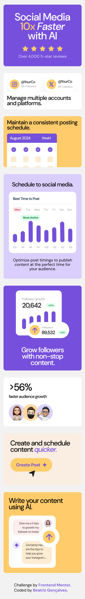

# Frontend Mentor - Solução para Bento Grid

Essa é a solução para o [Desafio Bento Grid do Frontend Mentor](https://www.frontendmentor.io/challenges/bento-grid-RMydElrlOj). Os desafios do Frontend Mentor ajudam você a melhorar suas habilidades de codificação através da construção de projetos realistas.

## Tabela de conteúdo

- [Frontend Mentor - Solução para Bento Grid](#frontend-mentor---solução-para-bento-grid)
  - [Tabela de conteúdo](#tabela-de-conteúdo)
  - [Visão Geral](#visão-geral)
    - [O desafio](#o-desafio)
    - [Screenshot](#screenshot)
      - [Desktop:](#desktop)
      - [Mobile:](#mobile)
    - [Links](#links)
  - [Meu processo](#meu-processo)
    - [Construído com](#construído-com)
    - [Desenvolvimento contínuo](#desenvolvimento-contínuo)
  - [Autora](#autora)

## Visão Geral

### O desafio

Os usuários deverão ser capazes de:

- Ver o layout ideal para a interface dependendo do tamanho da tela do dispositivo

### Screenshot

#### Desktop:

#### Mobile:

### Links

- Solução URL: [Frontend Mentor](https://www.frontendmentor.io/solutions/responsive-bento-grid--h5OL6D3H6)
- Site URL: [GitHub Pages](https://beatrizvsgoncalves.github.io/bento-grid-main/)

## Meu processo

### Construído com

- Tags Semânticas
- CSS Grid
- Flexbox
- Mobile-first Workflow
- Media Queries

### Desenvolvimento contínuo

Gostei de trabalhar com grid, quero fazer mais alguns desafios para treinar o uso desse recurso.

## Autora

- Github - [beatrizvsgoncalves](https://github.com/beatrizvsgoncalves)
- LinkedIn - [beatriz-vs-goncalves](https://www.linkedin.com/in/beatriz-vs-goncalves/)
- Frontend Mentor - [@beatrizvsgoncalves](https://www.frontendmentor.io/profile/beatrizvsgoncalves)